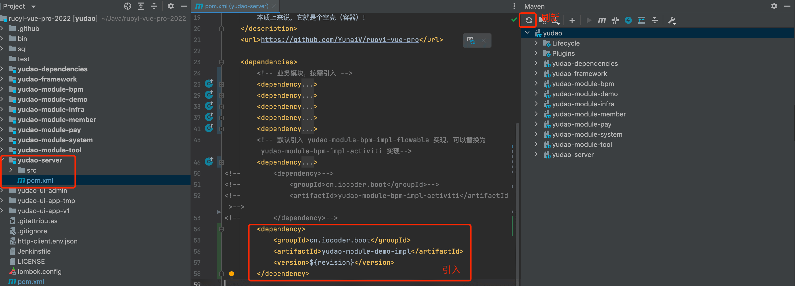

# 开发说明
- dev 是本地开发分支
- master-jdk17 是本地同步分支；始终与源仓库分支一致
- dev 合并源仓库更新，通过，在本地master-jdk17 分支上 rebase

```bash
# 1.fork开源项目到自己的仓库,比如从
github.com/abc/cherry => github.com/dhl/cherry
# 然后clone 
git clone https://github.com/dhl/cherry
# 2.接下来cd到自己的仓库，开始如下操作
cd cherry
git checkout -b dev    #默认是master，master里永远跟开源的保持一致
git pull
git checkout master   #切回master，做更新
git remote add upstream https://github.com/abc/cherry.git  #设置upstream开源仓库.
git fetch upstream master #拉取开源的仓库upstream的master到本地
git merge upstream/master  #合并到本地master
git checkout dev  #切换到dev
git rebase master  #把刚刚拉取的更新merge到dev分支


```

# 运行后端项目

## 开发文档

[开发文档](https://doc.iocoder.cn/feature/)

### 文档查看方式

> google 安装插件：Tampermonkey(篡改猴)

[下载地址](https://www.tampermonkey.net/changelog.php?version=5.3.3&ext=iikm&updated=true&old=5.3.2&intr=true)

> 脚本(Fuck-Yudao)

[下载地址](https://greasyfork.org/zh-CN/scripts/494723-yudao/feedback)

```javascript

// ==UserScript==
// @name         Fuck-Yudao
// @namespace    none
// @version      0.6
// @license      MIT
// @description  Help you climb over the paywall for a so-called "Free & Open Source Software", built by someone who truly understand our generations duty. To you-know-who: *thank you*. China's OSS environment got much better because of professionals like you.
// @author       The love you care
// @match        https://www.iocoder.cn/*
// @match        https://doc.iocoder.cn/*
// @match        https://cloud.iocoder.cn/*
// @grant        unsafeWindow
// @run-at document-end
// @downloadURL https://update.greasyfork.org/scripts/494723/Fuck-Yudao.user.js
// @updateURL https://update.greasyfork.org/scripts/494723/Fuck-Yudao.meta.js
// ==/UserScript==


(function() {
    'use strict';

    // Overwrite jqueryAlert, simply comment out `init` can disable the annoying dialog
    unsafeWindow.jqueryAlert = function(opts) {
        var dialog;
        dialog.show = function() {}
        // dialog.init();
        // dialog.close();
        return dialog;
    }


    // The content of yudao's pooly-written documentation. Almost at the same miserable level as uni-app's docs.
    // Read the docs of vue, react and a lot more responsible, real open source repos to learn how to make professional statements.
    let yudaosPoorlyWrittenDoc = null, prevPath = document.location.pathname;
    // The routes that are currently being marked as VIP only. Real jokes.
    const blockPathList = ["/bpm/", "/user-center/", "/social-user/", "/oauth2/", "/saas-tenant/", "/sms/", "/mail/", "/notify/", "/mybatis-pro/", "/dynamic-datasource/", "/report/", "/Spring-Boot", "/Spring-Cloud", "/api-doc/", "/module-new/", "/new-feature/", "/dev-hot-swap/", "/file/", "/message-queue/", "/job/", "/idempotent/", "/distributed-lock/", "/rate-limiter/", "/http-sign/", "/project-rename/", "/delete-code/", "/resource-permission/", "/data-permission/", "/deployment-linux/", "/deployment-docker/", "/registry-center/", "/config-center/", "/rpc/", "/gateway/", "/distributed-transaction/", "/server-protection/", "/cloud-debug/", "/mp/", "/mall/", "/pay/", "/crm/", "/member/", "/erp/", "/ai/", "/websocket/", "/vo/", "/system-log/"];

    // If the current url is 'blocked'.
    // You do know that for a static documentation site nothing is really blocked, don't you
    const isBlocked = () => {
        const ret = blockPathList.some((e) => document.location.pathname.includes(e));
        return ret;
    }

    // Get the documentation content wrapper element
    const getWrapper = () => {
        return document.querySelector('.content-wrapper');
    }

    const replace = (str) => {
        const wrapper = getWrapper()
        if (str) {
            while (wrapper.innerHTML !== str) {
                wrapper.innerHTML = str
            }
        }
    }

    const contentObserver = new MutationObserver(() => {
        if (getWrapper().innerHTML.includes('仅 VIP 可见')) {
            replace(yudaosPoorlyWrittenDoc)
        }
    })

    const urlObserver = new MutationObserver(() => {
        const wrapperEl = getWrapper()
        /*
        if (document.location.href !== 'https://doc.iocoder.cn/' && isBlocked() && !window.location.href.includes('refreshed')) {
            window.location.href = window.location.href + '?refreshed=1'
            // window.location.reload();
        }
        */
        if (prevPath !== document.location.pathname) {
            window.location.reload()
        }
    })

    urlObserver.observe(document.body, { childList: true })

    //=============================================================================================================================================

    const $$wrapper = getWrapper();
    if (getWrapper() && isBlocked()) {
        yudaosPoorlyWrittenDoc = $$wrapper.innerHTML.includes('仅 VIP 可见') ? null : $$wrapper.innerHTML;
        unsafeWindow.$$content = yudaosPoorlyWrittenDoc;
        unsafeWindow.$$replace = function() {
            replace(unsafeWindow.$$content)
        }
        contentObserver.observe($$wrapper, { childList: true, characterData: true, subtree: true });
        replace(yudaosPoorlyWrittenDoc);
    }

    //=============================================================================================================================================

})();

```

## 安装Apifox

[下载地址](https://apifox.com/?utm_source=baidu_pinzhuan&utm_medium=sem&utm_campaign=pinzhuan&utm_content=pinzhuan&utm_term=apifox)
[apt清华源](https://mirrors.tuna.tsinghua.edu.cn/help/ubuntu/)

## 安装Mysql

### 麒麟
[参考](https://blog.csdn.net/LogosTR_/article/details/125602116)

```bash
sudo apt update
sudo apt install mysql-server
mysql --version
service mysql status

# 配置
sudo mysql
use mysql;
select user, host, plugin from user;
# 将root对应的plugin由 auth_socket 改为 mysql_native_password 即使是mysql8.0也是，否则影响后续远程连接:
#MySQL8.0必须先执行此步骤设置密码，MySQL5.7可以选择先安装下面的secure！！！
alter user 'root'@'localhost' identified with mysql_native_password by 'root';

flush privileges;

exit;

```
### MAC

### DataGrip

[下载地址](https://www.jetbrains.com/datagrip/download/other.html)

## 安装Redis

[参考](https://redis.com.cn/linux-install-redis.html)

[官网](https://redis.io/docs/latest/operate/oss_and_stack/install/install-redis/install-redis-from-source/)
```bash
wget http://download.redis.io/redis-stable.tar.gz
tar -xzvf redis-stable.tar.gz
cd redis-stable
make

sudo make MALLOC=libc
make BUILD_TLS=yes
make install


# 运行
redis-server &
redis-server /etc/redis.conf
```

## Rebel 插件热加载

### 安装
[2022.4.1 版本](https://plugins.jetbrains.com/plugin/4441-jrebel-and-xrebel/versions)

> 激活地址：https://jrebel.qekang.com/1e67ec1b-122f-4708-87d0-c1995dc0cdaa
> 点击 Work Offine 按钮，设置为离线模式

### 使用
> 点击 Debug With JRebel 按钮； 使用 JRebel启动项目


## 启动问题处理

> 程序包cn.iocoder.yudao.framework.test.core.ut不存在

先编译安装一次

```bash
# 先编译 安装一次
mvn clean install package '-Dmaven.test.skip=true'
```

# 运行前端项目

## 安装node

[参考](https://www.iocoder.cn/NodeJS/mac-install/)

> coke


### nvm

```bash
curl -o- https://raw.githubusercontent.com/creationix/nvm/v0.33.8/install.sh | bash
# or
wget -qO- https://raw.githubusercontent.com/creationix/nvm/v0.33.8/install.sh | bash

# 验证
nvm --version
```

## node

```bash
# 先安装python 3.12

nvm install stable

node -v
npm -v

# 安装 pnpm，提升依赖的安装速度
npm config set registry https://registry.npmmirror.com
npm install -g pnpm
```

## 启动项目

```bash
git clone https://github.com/yudaocode/yudao-ui-admin-vue3.git


# 安装依赖
pnpm install

# 启动服务
npm run dev

```


# 运行小程序

[uni-app官网](https://uniapp.dcloud.net.cn/quickstart.html)

```bash
# 安装依赖
pnpm install

# tab 栏运行
```

# 后端开发
## 结构理解
### yudao-dependencies
> Maven 依赖版本管理

### 业务功能模块：yudao-module-xxx

### 框架封装：yudao-framework

> 技术组件：技术相关的组件封装，例如说 MyBatis、Redis 等等

> 业务组件：业务相关的组件封装，例如说数据字典、操作日志等等。如果是业务组件，名字会包含 biz 关键字

> 每个组件，包含两部分：

- core 包：组件的核心封装，拓展相关的功能。
- config 包：组件的 Spring Boot 自动配置。

## 管理后台/服务端：yudao-server

> 每个模块包含两个 Maven Module，分别是：

- yudao-module-xxx-api	提供给其它模块的 API 定义
- yudao-module-xxx-biz	模块的功能的具体实现


> 例如说，yudao-module-infra 想要访问 yudao-module-system 的用户、部门等数据，需要引入 yudao-module-system-api 子模块

疑问：为什么设计 `yudao-module-xxx-api` 模块呢？

明确需要提供给其它模块的 API 定义，方便未来迁移微服务架构。
模块之间可能会存在相互引用的情况，虽然说从系统设计上要尽量避免，但是有时在快速迭代的情况下，可能会出现。此时，通过只引用对方模块的 API 子模块，解决相互引用导致 Maven 无法打包的问题。


> yudao-module-xxx-api 子模块的项目结构如下


> yudao-module-xxx-biz 子模块的项目结构如下：


```
为什么 Controller 分成 Admin 和 App 两种？

提供给 Admin 和 App 的 RESTful API 接口是不同的，拆分后更加清晰。

疑问：为什么 VO 分成 Admin 和 App 两种？

相同功能的 RESTful API 接口，对于 Admin 和 App 传入的参数、返回的结果都可能是不同的。例如说，Admin 查询某个用户的基本信息时，可以返回全部字段；而 App 查询时，不会返回 mobile 手机等敏感字段。

疑问：为什么 DO 不作为 Controller 的出入参？

明确每个 RESTful API 接口的出入参。例如说，创建部门时，只需要传入 name、parentId 字段，使用 DO 接参就会导致 type、createTime、creator 等字段可以被传入，导致前端同学一脸懵逼。
每个 RESTful API 有自己独立的 VO，可以更好的设置 Swagger 注解、Validator 校验规则，而让 DO 保持整洁，专注映射好数据库表。
疑问：为什么操作 Redis 需要通过 RedisDAO？


Service 直接使用 RedisTemplate 操作 Redis，导致大量 Redis 的操作细节和业务逻辑杂糅在一起，导致代码不够整洁。通过 RedisDAO 类，将每个 Redis Key 像一个数据表一样对待，清晰易维护。
```

> 总结来说，每个模块采用三层架构 + 非严格分层，如下图所示


```
疑问：如果 message 需要跨模块共享，类似 api 的效果，可以怎么做？

可以在 yudao-module-xxx-api 子模块下，新建一个 message 包，可参考 MemberUserCreateMessage 类。

```

>  yudao-server

该模块是后端 Server 的主项目，通过引入需要 yudao-module-xxx 业务模块，从而实现提供 RESTful API 给 yudao-ui-admin-vue3、yudao-mall-uniapp 等前端项目。

本质上来说，它就是个空壳（容器）！如下图所示

# 开发手册

## 新建模块

[新建模块](https://doc.iocoder.cn/module-new/#_1-%E6%96%B0%E5%BB%BA-demo-%E6%A8%A1%E5%9D%97)

```
① 新建模块 ： yudao-module-demo
② 删除新建模块 src 文件
③ 修改yudao-module-demo pom文件
    
    ① 在yudao-module-demo新建 yudao-module-demo-api 子模块
        - parent 选择  yudao-module-demo
    ② 修改yudao-module-demo-api pom 文件
    ③ 【可选】在 yudao-module-demo-api模块，新建 cn.iocoder.yudao.module.demo 基础包，其中 demo 为模块名。之后，新建 api 和 enums 包
    
    ① 新建 yudao-module-demo-biz 子模块，整个过程和“新建 demo 模块”是一致的
    ② 修改 pom
    ③ 【必选】新建 cn.iocoder.yudao.module.demo 基础包，其中 demo 为模块名。之后，新建 controller.admin 和 controller.user 等包
    
```

> yudao-module-demo
```xml
<?xml version="1.0" encoding="UTF-8"?>
<project xmlns="http://maven.apache.org/POM/4.0.0"
         xmlns:xsi="http://www.w3.org/2001/XMLSchema-instance"
         xsi:schemaLocation="http://maven.apache.org/POM/4.0.0 http://maven.apache.org/xsd/maven-4.0.0.xsd">
    <parent>
        <artifactId>yudao</artifactId>
        <groupId>cn.iocoder.boot</groupId>
        <version>${revision}</version> <!-- 1. 修改 version 为 ${revision} -->
    </parent>
    <modelVersion>4.0.0</modelVersion>

    <artifactId>yudao-module-demo</artifactId>
    <packaging>pom</packaging> <!-- 2. 新增 packaging 为 pom -->

    <name>${project.artifactId}</name> <!-- 3. 新增 name 为 ${project.artifactId} -->
    <description> <!-- 4. 新增 description 为该模块的描述 -->
        demo 模块，主要实现 XXX、YYY、ZZZ 等功能。
    </description>

</project>
```

> yudao-module-demo-api

```xml
<?xml version="1.0" encoding="UTF-8"?>
<project xmlns="http://maven.apache.org/POM/4.0.0"
         xmlns:xsi="http://www.w3.org/2001/XMLSchema-instance"
         xsi:schemaLocation="http://maven.apache.org/POM/4.0.0 http://maven.apache.org/xsd/maven-4.0.0.xsd">
    <parent>
        <artifactId>yudao-module-demo</artifactId>
        <groupId>cn.iocoder.boot</groupId>
        <version>${revision}</version> <!-- 1. 修改 version 为 ${revision} -->
    </parent>
    <modelVersion>4.0.0</modelVersion>
    <artifactId>yudao-module-demo-api</artifactId>
    <packaging>jar</packaging> <!-- 2. 新增 packaging 为 jar -->

    <name>${project.artifactId}</name> <!-- 3. 新增 name 为 ${project.artifactId} -->
    <description> <!-- 4. 新增 description 为该模块的描述 -->
        demo 模块 API，暴露给其它模块调用
    </description>

    <dependencies>  <!-- 5. 新增 yudao-common 依赖 -->
        <dependency>
            <groupId>cn.iocoder.boot</groupId>
            <artifactId>yudao-common</artifactId>
        </dependency>
    </dependencies>

</project>
```

## 新建 RESTful API 接口

> 在 controller.admin 包，新建一个 DemoTestController 类，并新建一个 /demo/test/get 接口
> 注意，/demo 是该模块所有 RESTful API 的基础路径，/test 是 Test 功能的基础路径。

```java
package cn.iocoder.yudao.module.demo.controller.admin;

import cn.iocoder.yudao.framework.common.pojo.CommonResult;
import io.swagger.v3.oas.annotations.tags.Tag;
import io.swagger.v3.oas.annotations.Operation;
import org.springframework.validation.annotation.Validated;
import org.springframework.web.bind.annotation.GetMapping;
import org.springframework.web.bind.annotation.RequestMapping;
import org.springframework.web.bind.annotation.RestController;

import static cn.iocoder.yudao.framework.common.pojo.CommonResult.success;

@Tag(name = "管理后台 - Test")
@RestController
@RequestMapping("/demo/test")
@Validated
public class DemoTestController {

    @GetMapping("/get")
    @Operation(summary = "获取 test 信息")
    public CommonResult<String> get() {
        return success("true");
    }

}
```

> 在 controller.app 包，新建一个 AppDemoTestController 类，并新建一个 /demo/test/get 接口。代码如下

`
在 Controller 的命名上，额外增加 App 作为前缀，一方面区分是管理后台还是用户 App 的 Controller，另一方面避免 Spring Bean 的名字冲突。

可能你会奇怪，这里我们定义了两个 /demo/test/get 接口，会不会存在重复导致冲突呢？答案，当然是并不会。原因是：

controller.admin 包下的接口，默认会增加 /admin-api，即最终的访问地址是 /admin-api/demo/test/get
controller.app 包下的接口，默认会增加 /app-api，即最终的访问地址是 /app-api/demo/test/get
`

```java
package cn.iocoder.yudao.module.demo.controller.app;

import cn.iocoder.yudao.framework.common.pojo.CommonResult;
import io.swagger.v3.oas.annotations.tags.Tag;
import io.swagger.v3.oas.annotations.Operation;
import org.springframework.validation.annotation.Validated;
import org.springframework.web.bind.annotation.GetMapping;
import org.springframework.web.bind.annotation.RequestMapping;
import org.springframework.web.bind.annotation.RestController;

import static cn.iocoder.yudao.framework.common.pojo.CommonResult.success;

@Tag(name = "用户 App - Test")
@RestController
@RequestMapping("/demo/test")
@Validated
public class AppDemoTestController {

    @GetMapping("/get")
    @Operation(summary = "获取 test 信息")
    public CommonResult<String> get() {
        return success("true");
    }

}
```

> 引入 demo 模块

`在 yudao-server 模块的 pom.xml 文件，引入 yudao-module-demo-biz 子模块，并点击 Maven 刷新。如下图所示：`



`运行 YudaoServerApplication 类，将后端项目进行启动。启动完成后，使用浏览器打开 http://127.0.0.1:48080/doc.html (opens new window)地址，进入 Swagger 接口文档`

## 代码生成【表单】

### 建表

```sql
use `ruoyi-vue-pro`;
CREATE TABLE `system_group` (
                                `id` bigint NOT NULL AUTO_INCREMENT COMMENT '编号',
                                `name` varchar(255) COLLATE utf8mb4_unicode_ci NOT NULL COMMENT '名字',
                                `description` varchar(512) COLLATE utf8mb4_unicode_ci DEFAULT NULL COMMENT '描述',
                                `status` tinyint NOT NULL COMMENT '状态',
                                `creator` varchar(64) CHARACTER SET utf8mb4 COLLATE utf8mb4_unicode_ci DEFAULT '' COMMENT '创建者',
                                `create_time` datetime NOT NULL DEFAULT CURRENT_TIMESTAMP COMMENT '创建时间',
                                `updater` varchar(64) CHARACTER SET utf8mb4 COLLATE utf8mb4_unicode_ci DEFAULT '' COMMENT '更新者',
                                `update_time` datetime NOT NULL DEFAULT CURRENT_TIMESTAMP ON UPDATE CURRENT_TIMESTAMP COMMENT '更新时间',
                                `deleted` bit(1) NOT NULL DEFAULT b'0' COMMENT '是否删除',
                                `tenant_id` bigint NOT NULL DEFAULT '0' COMMENT '租户编号',
                                PRIMARY KEY (`id`) USING BTREE
) ENGINE=InnoDB DEFAULT CHARSET=utf8mb4 COLLATE=utf8mb4_unicode_ci COMMENT='用户组';
```
`
① 表名的前缀，要和 Maven Module 的模块名保持一致。例如说，用户组在 yudao-module-system 模块，所以表名的前缀是 system_。 代码生成器会自动解析表名的前缀，获得其所属的 Maven Module 模块，简化配置过程。
② 设置 ID 主键，一般推荐使用 bigint 长整形，并设置自增长。
③ 正确设置每个字段是否允许空，代码生成器会根据它生成参数是否允许空的校验规则。
④ 正确设置注释，代码生成器会根据它生成字段名与提示等信息。
⑤ 添加 creator、create_time、updater、update_time、deleted 是必须设置的系统字段；如果开启多租户的功能，并且该表需要多租户的隔离，则需要添加 tenant_id 字段。`

### 代码生成

> 点击 [基础设施 -> 代码生成] 菜单，点击 [基于 DB 导入] 按钮，选择 system_group 表，后点击 [确认] 按钮。

> 编辑配置

- 点击 system_group 所在行的 [编辑] 按钮，修改生成配置
- 将 status 字段的显示类型为【下拉框】，字典类型为【系统状态】。
- 将 description 字段的【查询】取消。
- 将 id、name、description、status 字段的【示例】填写上。 
- 将【上级菜单】设置为【系统管理】。
- 将【前端类型】设置为“前端项目”对应的“前端类型”。例如说，我们这里演示的是 yudao-ui-admin-vue3 前端项目，则选择了【Vue3 Element Plus 标准模版】。

`
字段信息
插入：新增时，是否传递该字段。
编辑：修改时，是否传递该字段。
列表：Table 表格，是否展示该字段。
查询：搜索框，是否支持该字段查询，查询的条件是什么。
允许空：新增或修改时，是否必须传递该字段，用于 Validator 参数校验。
字典类型：在显示类型是下拉框、单选框、复选框时，选择使用的字典。
示例：参数示例，用于 Swagger 接口文档的 example 示例。
`

`
生成信息
生成场景：分成管理后台、用户 App 两种，用于生成 Controller 放在 admin 还是 app 包。
上级菜单：生成场景是管理后台时，需要设置其所属的上级菜单。
前端类型： 提供多种 UI 模版。后端的 application.yaml 配置文件中的 yudao.codegen.front-type 配置项，设置默认的 UI 模版，避免每次都需要设置。
`

> 预览代码

点击 system_group 所在行的 [预览] 按钮，在线预览生成的代码，检查是否符合预期。

> 生成代码

点击 system_group 所在行的 [生成代码] 按钮，下载生成代码的压缩包，双击进行解压。

复制代码到对应目录位置

### 代码运行-后端运行

① 将生成的后端代码，复制到项目中
② 将 ErrorCodeConstants.java_手动操作 文件的错误码，复制到该模块 ErrorCodeConstants 类中，并设置对应的错误码编号，之后进行删除。
③ 将 h2.sql 的 CREATE 语句复制到该模块的 create_tables.sql 文件，DELETE 语句复制到该模块的 clean.sql
`最新版本，第 ③ 部分的单元测试，默认已经不在生成。所以，不需要操作这一步。
原因是：大多数团队，没有编写单元测试的习惯，导致生成的单元测试代码，会被直接删除。所以，我们默认不生成单元测试代码，减少不必要的代码生成。
如果想要开启，可以把 yudao.codegen.unit-test-enable 配置项设置为 true，然后重新生成代码。
另外，如果你想要编写单元测试，可以考虑使用 MarsCode (opens new window)智能编码插件，可以免费生成不错的单元测试
`
`疑问：create_tables.sql 和 clean.sql 文件的作用是什么？
项目的单元测试，需要使用到 H2 内存数据库，create_tables.sql 用于创建所有的表结构，clean.sql 用于每个单元测试的方法跑完后清理数据。
然后，运行 GroupServiceImplTest 单元测试，执行通过。`
④ 打开数据库工具，运行代码生成的 sql/sql.sql 文件，用于菜单的初始化。
⑤ Debug 运行 YudaoServerApplication 类，启动后端项目。通过 IDEA 的 [Actuator -> Mappings] 菜单，可以看到代码生成的 GroupController 的 RESTful API 接口已经生效。


### 代码运行-前端运行

① 将生成的前端代码，复制到项目中。
② 重新执行 npm run dev 命令，启动前端项目。点击 [系统管理 -> 菜单管理] 菜单，点击【刷新菜单缓存】，因为前端项目会缓存菜单在内存中的，所以需要刷新一下。
③ 点击 [系统管理 -> 用户组管理] 菜单，就可以看到用户组的 UI 界面。
至此，我们已经完成了【用户组】功能的代码生成，基本节省了你 80% 左右的开发任务，后续可以根据自己的需求，进行剩余的 20% 的开发！

### 后续变更

随着业务的发展，已经生成代码的功能需要变更。继续以【用户组】举例子，它的 system_group 表需要新增一个分类 category 字段，此时不建议使用代码生成器，而是直接修改已经生成的代码：

① 后端：修改 GroupDO 数据实体类、GroupSaveReqVO 保存 VO 类、GroupSaveRespVO 响应 VO 类，新增 category 字段。

② 前端：修改 Vue 的 index.vue 列表和 Form 表单组件，新增 category 字段。

③ 重新编译后后端，并进行启动。

over！非常简单方便，即保证了代码的整洁规范，又不增加过多的开发量。

## 代码生成【主子表】

*主子表，指的是一个主表，被多个子表所关联，关联的关系是一对一或一对多。*

例如说：主表是【学生】，子表可以是：

子表是【成绩】，两者是“一对多”的关系，一个学生可以有多个成绩。
子表是【班级】，两者是“一对一”的关系，一个学生只能有一个班级。
下面，我们将演示“主子表”的使用，基于代码生成器，在 yudao-module-system 模块中，开发一个【学生】的功能。

*目前只有 yudao-ui-admin-vue3 支持主子表，yudao-ui-admin-vue2、yudao-ui-admin-vben 正在适配中*

### 标准模式

对应 [基础设施 -> 代码生成案例 -> 主子表（标准）] 菜单。

在新增和修改时，主表和子表在一个弹窗表单中，一起提交。

### 内嵌模式

对应 [基础设施 -> 代码生成案例 -> 主子表（内嵌）] 菜单。

在「标准模式」的基础之上，列表 **内嵌** 子表的列表。如下

### ERP模式

对应 [基础设施 -> 代码生成案例 -> 主子表（ERP）] 菜单。

主表和子表，独立列表，也独立表单

### 表设计

① 设计 **主表** 的数据库表名为 `system_student` 学生表

```sql
CREATE TABLE `system_student` (
  `id` bigint NOT NULL AUTO_INCREMENT COMMENT '编号',
  `name` varchar(100) CHARACTER SET utf8mb4 COLLATE utf8mb4_unicode_ci NOT NULL DEFAULT '' COMMENT '名字',
  `birthday` datetime NOT NULL COMMENT '出生日期',
  `description` varchar(255) CHARACTER SET utf8mb4 COLLATE utf8mb4_0900_ai_ci NOT NULL COMMENT '简介',
  `creator` varchar(64) CHARACTER SET utf8mb4 COLLATE utf8mb4_unicode_ci DEFAULT '' COMMENT '创建者',
  `create_time` datetime NOT NULL DEFAULT CURRENT_TIMESTAMP COMMENT '创建时间',
  `updater` varchar(64) CHARACTER SET utf8mb4 COLLATE utf8mb4_unicode_ci DEFAULT '' COMMENT '更新者',
  `update_time` datetime NOT NULL DEFAULT CURRENT_TIMESTAMP ON UPDATE CURRENT_TIMESTAMP COMMENT '更新时间',
  `deleted` bit(1) NOT NULL DEFAULT b'0' COMMENT '是否删除',
  `tenant_id` bigint NOT NULL DEFAULT '0' COMMENT '租户编号',
  PRIMARY KEY (`id`) USING BTREE
) ENGINE=InnoDB AUTO_INCREMENT=10 DEFAULT CHARSET=utf8mb4 COLLATE=utf8mb4_unicode_ci COMMENT='学生表';
```

② 设计 **子表** 的数据库表名为 `system_student_course` 学生课程表

```sql
CREATE TABLE `system_student_course` (
  `id` bigint NOT NULL AUTO_INCREMENT COMMENT '编号',
  `student_id` bigint NOT NULL COMMENT '学生编号',
  `name` varchar(100) CHARACTER SET utf8mb4 COLLATE utf8mb4_unicode_ci NOT NULL DEFAULT '' COMMENT '名字',
  `score` tinyint NOT NULL COMMENT '分数',
  `creator` varchar(64) CHARACTER SET utf8mb4 COLLATE utf8mb4_unicode_ci DEFAULT '' COMMENT '创建者',
  `create_time` datetime NOT NULL DEFAULT CURRENT_TIMESTAMP COMMENT '创建时间',
  `updater` varchar(64) CHARACTER SET utf8mb4 COLLATE utf8mb4_unicode_ci DEFAULT '' COMMENT '更新者',
  `update_time` datetime NOT NULL DEFAULT CURRENT_TIMESTAMP ON UPDATE CURRENT_TIMESTAMP COMMENT '更新时间',
  `deleted` bit(1) NOT NULL DEFAULT b'0' COMMENT '是否删除',
  `tenant_id` bigint NOT NULL DEFAULT '0' COMMENT '租户编号',
  PRIMARY KEY (`id`) USING BTREE
) ENGINE=InnoDB AUTO_INCREMENT=14 DEFAULT CHARSET=utf8mb4 COLLATE=utf8mb4_unicode_ci COMMENT='学生课程表';
```

它和主表的关系是一对多，一个学生可以有多个课程，通过 `student_id` 字段进行关联

③ 设计 **子表** 的数据表名为 `system_student_grade` 学生班级表

```sql
CREATE TABLE `system_student_grade` (
  `id` bigint NOT NULL AUTO_INCREMENT COMMENT '编号',
  `student_id` bigint NOT NULL COMMENT '学生编号',
  `name` varchar(100) CHARACTER SET utf8mb4 COLLATE utf8mb4_unicode_ci NOT NULL DEFAULT '' COMMENT '名字',
  `teacher` varchar(255) COLLATE utf8mb4_unicode_ci NOT NULL COMMENT '班主任',
  `creator` varchar(64) CHARACTER SET utf8mb4 COLLATE utf8mb4_unicode_ci DEFAULT '' COMMENT '创建者',
  `create_time` datetime NOT NULL DEFAULT CURRENT_TIMESTAMP COMMENT '创建时间',
  `updater` varchar(64) CHARACTER SET utf8mb4 COLLATE utf8mb4_unicode_ci DEFAULT '' COMMENT '更新者',
  `update_time` datetime NOT NULL DEFAULT CURRENT_TIMESTAMP ON UPDATE CURRENT_TIMESTAMP COMMENT '更新时间',
  `deleted` bit(1) NOT NULL DEFAULT b'0' COMMENT '是否删除',
  `tenant_id` bigint NOT NULL DEFAULT '0' COMMENT '租户编号',
  PRIMARY KEY (`id`) USING BTREE
) ENGINE=InnoDB AUTO_INCREMENT=10 DEFAULT CHARSET=utf8mb4 COLLATE=utf8mb4_unicode_ci COMMENT='学生班级表';
```

它和主表的关系是一对一，一个学生只能有一个班级，通过 `student_id` 字段进行关联。

### 代码生成

> 导入表

点击 [基础设施 -> 代码生成] 菜单，点击 [基于 DB 导入] 按钮，选择 `system_student`、`system_student_course`、`system_student_grade` 表，后点击 [确认] 按钮。

> 编辑配置（主表）

点击 `system_student` 所在行的 [编辑] 按钮，修改生成配置。

- 将【生成模版】设置为【主表（标准模式）】。🔥最最关键的步骤！
- 将【上级菜单】设置为【系统管理】。
- 将【前端类型】设置为“前端项目”对应的“前端类型”。例如说，我们这里演示的是 `yudao-ui-admin-vue3` 前端项目，则选择了【Vue3 Element Plus 标准模版】。

> 编辑配置（子表）

① 点击 `system_student_course` 所在行的 [编辑] 按钮，修改生成配置。

- 将【生成模版】设置为【子表】。🔥最最关键的步骤！
- 业务名：一般建议和【主表】保持一致，所以这里改成了 `student`。
- 主表信息：将【关联的主表】设置为 `system_student` 表，将【子表关联的字段】设置为 `student_id` 字段，将【关联关系】设置为“一对多”。

② 点击 `system_student_grade` 所在行的 [编辑] 按钮，修改生成配置。

- （同上）将【生成模版】设置为【子表】。🔥最最关键的步骤！
- （同上）业务名：一般建议和【主表】保持一致，所以这里改成了 `student`。
- （基本同上，关联关系不同）主表信息：将【关联的主表】设置为 `system_student` 表，将【子表关联的字段】设置为 `student_id` 字段，将【关联关系】设置为“一对一”

> 预览代码

点击 `system_student` 所在行的 [预览] 按钮，在线预览生成的代码，检查是否符合预期。

> 生成代码

点击 `system_student` 所在行的 [生成] 按钮，生成代码。

> 代码运行

和 [《代码生成【单表】》](https://doc.iocoder.cn/new-feature/) 一致，就不重复赘述。

copy system_student 表的代码就行


## 代码生成【树表】

树表，是在“单表”的基础上，增加了「树形结构」的功能。

例如说：部门、分类等，是一个树形结构。我们可以通过树形结构，来展示部门、分类的层级关系。

下面，我们将演示“树表”的使用，基于代码生成器，在 `yudao-module-system` 模块中，开发一个【**分类**】的功能。

### 数据库表结构设计

```sql
CREATE TABLE `system_category` (
  `id` bigint NOT NULL AUTO_INCREMENT COMMENT '编号',
  `name` varchar(100) CHARACTER SET utf8mb4 COLLATE utf8mb4_unicode_ci NOT NULL DEFAULT '' COMMENT '名字',
  `parent_id` bigint NOT NULL COMMENT '父级编号',
  `creator` varchar(64) CHARACTER SET utf8mb4 COLLATE utf8mb4_unicode_ci DEFAULT '' COMMENT '创建者',
  `create_time` datetime NOT NULL DEFAULT CURRENT_TIMESTAMP COMMENT '创建时间',
  `updater` varchar(64) CHARACTER SET utf8mb4 COLLATE utf8mb4_unicode_ci DEFAULT '' COMMENT '更新者',
  `update_time` datetime NOT NULL DEFAULT CURRENT_TIMESTAMP ON UPDATE CURRENT_TIMESTAMP COMMENT '更新时间',
  `deleted` bit(1) NOT NULL DEFAULT b'0' COMMENT '是否删除',
  `tenant_id` bigint NOT NULL DEFAULT '0' COMMENT '租户编号',
  PRIMARY KEY (`id`) USING BTREE
) ENGINE=InnoDB AUTO_INCREMENT=6 DEFAULT CHARSET=utf8mb4 COLLATE=utf8mb4_unicode_ci COMMENT='分类表';
```

其中 `parent_id` 字段，用于标识父级分类的编号。如果是顶级分类，则 `parent_id` 为 `0`


### 代码生成

> 导入表，点击 [基础设施 -> 代码生成] 菜单，点击 [基于 DB 导入] 按钮，选择 `system_category` 表，后点击 [确认] 按钮。

> 编辑配置，点击 `system_category` 所在行的 [编辑] 按钮，修改生成配置。

- 将【生成模版】设置为【树表】。🔥最最关键的步骤！
- 树表信息：将【父编号字段】设置为 `parent_id` 字段，将【树名称字段】设置为 `name` 字段。
- 将【上级菜单】设置为【系统管理】。
- 将【前端类型】设置为“前端项目”对应的“前端类型”。例如说，我们这里演示的是 `yudao-ui-admin-vue3` 前端项目，则选择了【Vue3 Element Plus 标准模版】。

> 预览代码：点击 `system_category` 所在行的 [预览] 按钮，在线预览生成的代码，检查是否符合预期

> 生成代码：点击 `system_category` 所在行的 [生成] 按钮，生成代码

> 代码运行

## 用户体系

- AdminUser 管理员用户，前端访问 [`yudao-ui-admin-vue3` (opens new window)](https://github.com/yudaocode/yudao-ui-admin-vue3)管理后台，后端访问 `/admin-api/**` RESTful API 接口。
- MemberUser 会员用户，前端访问 [`yudao-mall-uniapp` (opens new window)](https://gitee.com/yudaocode/yudao-mall-uniapp)用户 App，后端访问 `/app-api/**` RESTful API 接口。

虽然是不同类型的用户，他们访问 RESTful API 接口时，都通过 Token 认证机制

### 表结构

>  2 种类型的时候，采用不同数据库的表进行存储，管理员用户对应 [`system_users` (opens new window)](https://github.com/YunaiV/ruoyi-vue-pro/blob/master/yudao-module-system/yudao-module-system-biz/src/main/java/cn/iocoder/yudao/module/system/dal/dataobject/user/AdminUserDO.java)表，会员用户对应 [`member_user` (opens new window)](https://github.com/YunaiV/ruoyi-vue-pro/blob/master/yudao-module-member/yudao-module-member-biz/src/main/java/cn/iocoder/yudao/module/member/dal/dataobject/user/MemberUserDO.java)表

*为什么不使用统一的用户表？*

*确实可以采用这样的方案，新增 `type` 字段区分用户类型。不同用户类型的信息字段，例如说上图的 `dept_id`、`post_ids` 等等，可以增加拓展表，或者就干脆“冗余”在用户表中。*

*不过实际项目中，不同类型的用户往往是不同的团队维护，并且这也是绝大多团队的实践，所以我们采用了多个用户表的方案。*

`如果表需要关联多种类型的用户，例如说上述的 system_oauth2_access_token 访问令牌表，可以通过 user_type 字段进行区分。并且 user_type 对应 [UserTypeEnum (opens new window)](https://github.com/YunaiV/ruoyi-vue-pro/blob/master/yudao-framework/yudao-common/src/main/java/cn/iocoder/yudao/framework/common/enums/UserTypeEnum.java)全局枚举`

### 获取当前登录用户

> 使用 [SecurityFrameworkUtils (opens new window)](https://github.com/YunaiV/ruoyi-vue-pro/blob/master/yudao-framework/yudao-spring-boot-starter-security/src/main/java/cn/iocoder/yudao/framework/security/core/util/SecurityFrameworkUtils.java)提供的如下方法，可以获得当前登录用户的信息

```java
// 获取当前用户信息
public static LoginUser getLoginUser();
// 获取当前用户编号
public static Long getLoginUserId();
// 获取当前用户昵称(仅适合 AdminUser 管理员用户)
public static LoginUser getLoginUserNickname();
// 获取当前用户部门(仅适合 AdminUser 管理员用户)
public static Long getLoginUserDeptId();
```

> 获取更多用户信息

① 在 OAuth2TokenServiceImpl 的 `#buildUserInfo(...)` 方法中，补充读取更多的用户信息，例如说 `mobile`、`sex` 等等。

② 在 SecurityFrameworkUtils 新增对应的 `getXXX()` 静态方法，

### 账号密码登录

> 后台管理实现

使用 `username` 账号 + `password` 密码进行登录，由 [AuthController (opens new window)](https://github.com/YunaiV/ruoyi-vue-pro/blob/master/yudao-module-system/yudao-module-system-biz/src/main/java/cn/iocoder/yudao/module/system/controller/admin/auth/AuthController.java#L55-L62)提供 `/admin-api/system/auth/login` 接口。代码如下：

```java
@PostMapping("/login")
@Operation(summary = "使用账号密码登录")
public CommonResult<AuthLoginRespVO> login(@RequestBody @Valid AuthLoginReqVO reqVO) {
    String token = authService.login(reqVO, getClientIP(), getUserAgent());
    // 返回结果
    return success(AuthLoginRespVO.builder().token(token).build());
}
```

`如何关闭验证码？`

`参见 [《后端手册 —— 验证码》](https://doc.iocoder.cn/captcha/) 文档`

> 用户APP实现

使用 `mobile` 手机 + `password` 密码进行登录，由 [AppAuthController (opens new window)](https://github.com/YunaiV/ruoyi-vue-pro/blob/master/yudao-module-member/yudao-module-member-biz/src/main/java/cn/iocoder/yudao/module/member/controller/app/auth/AppAuthController.java#L34-L41)提供 `/app-api/member/auth/login` 接口。代码如下：

```java
@PostMapping("/login")
@Operation(summary = "使用手机 + 密码登录")
public CommonResult<AppAuthLoginRespVO> login(@RequestBody @Valid AppAuthLoginReqVO reqVO) {
    String token = authService.login(reqVO, getClientIP(), getUserAgent());
    // 返回结果
    return success(AppAuthLoginRespVO.builder().token(token).build());
}
```

### 手机验证码登录

> 管理后台实现

① 使用 `mobile` 手机号获得验证码，由 [AuthController (opens new window)](https://github.com/YunaiV/ruoyi-vue-pro/blob/master/yudao-module-system/yudao-module-system-biz/src/main/java/cn/iocoder/yudao/module/system/controller/admin/auth/AuthController.java#L105-L111)提供 `/admin-api/system/auth/send-sms-code` 接口。代码如下：

```java
@PostMapping("/send-sms-code")
@Operation(summary = "发送手机验证码")
public CommonResult<Boolean> sendSmsCode(@RequestBody @Valid AuthSendSmsReqVO reqVO) {
    authService.sendSmsCode(getLoginUserId(), reqVO);
    return success(true);
}
```

② 使用 `mobile` 手机 + `code` 验证码进行登录，由 [AppAuthController (opens new window)](https://github.com/YunaiV/ruoyi-vue-pro/blob/master/yudao-module-system/yudao-module-system-biz/src/main/java/cn/iocoder/yudao/module/system/controller/admin/auth/AuthController.java#L96-L103)提供 `/admin-api/system/auth/sms-login` 接口。代码如下：

```java
@PostMapping("/sms-login")
@Operation(summary = "使用短信验证码登录")
public CommonResult<AuthLoginRespVO> smsLogin(@RequestBody @Valid AuthSmsLoginReqVO reqVO) {
    String token = authService.smsLogin(reqVO, getClientIP(), getUserAgent());
    // 返回结果
    return success(AuthLoginRespVO.builder().token(token).build());
}
```

> 用户APP实现

① 使用 `mobile` 手机号获得验证码，由 [AppAuthController (opens new window)](https://github.com/YunaiV/ruoyi-vue-pro/blob/master/yudao-module-member/yudao-module-member-biz/src/main/java/cn/iocoder/yudao/module/member/controller/app/auth/AppAuthController.java#L52-L58)提供 `/app-api/member/auth/send-sms-code` 接口。代码如下

```java
@PostMapping("/send-sms-code")
@Operation(summary = "发送手机验证码")
public CommonResult<Boolean> sendSmsCode(@RequestBody @Valid AppAuthSendSmsReqVO reqVO) {
    authService.sendSmsCode(getLoginUserId(), reqVO);
    return success(true);
}
```

② 使用 `mobile` 手机 + `code` 验证码进行登录，由 [AppAuthController (opens new window)](https://github.com/YunaiV/ruoyi-vue-pro/blob/master/yudao-module-member/yudao-module-member-biz/src/main/java/cn/iocoder/yudao/module/member/controller/app/auth/AppAuthController.java#L43-L50)提供 `/app-api/member/auth/sms-login` 接口。

```java
@PostMapping("/sms-login")
@Operation(summary = "使用手机 + 验证码登录")
public CommonResult<AppAuthLoginRespVO> smsLogin(@RequestBody @Valid AppAuthSmsLoginReqVO reqVO) {
    String token = authService.smsLogin(reqVO, getClientIP(), getUserAgent());
    // 返回结果
    return success(AppAuthLoginRespVO.builder().token(token).build());
}
```

如果用户未注册，会自动使用手机号进行注册会员用户。**所以，`/app-api/member/user/sms-login` 接口也提供了用户注册的功能**。

### 三方登录

详细参见 [《开发指南 —— 三方登录》](https://doc.iocoder.cn/social-user) 文章。

> 后台管理实现

① 跳转第三方平台，来获得三方授权码，由 [AuthController (opens new window)](https://github.com/YunaiV/ruoyi-vue-pro/blob/master/yudao-module-system/yudao-module-system-biz/src/main/java/cn/iocoder/yudao/module/system/controller/admin/auth/AuthController.java#L97-L106)提供 `/admin-api/system/auth/social-auth-redirect` 接口。

```java
@GetMapping("/social-auth-redirect")
@Operation(summary = "社交授权的跳转")
@Parameters({
        @Parameter(name = "type", description = "社交类型", required = true),
        @Parameter(name = "redirectUri", description = "回调路径")
})
public CommonResult<String> socialAuthRedirect(@RequestParam("type") Integer type,
                                                @RequestParam("redirectUri") String redirectUri) {
    return CommonResult.success(socialUserService.getAuthorizeUrl(type, redirectUri));
}
```

② 使用 `code` 三方授权码进行快登录，由 [AuthController (opens new window)](https://github.com/YunaiV/ruoyi-vue-pro/blob/master/yudao-module-system/yudao-module-system-biz/src/main/java/cn/iocoder/yudao/module/system/controller/admin/auth/AuthController.java#L149-L154)提供 `/admin-api/system/auth/social-login` 接口。代码如下

```java
@PostMapping("/social-login")
@Operation(summary = "社交快捷登录，使用 code 授权码")
public CommonResult<AuthLoginRespVO> socialQuickLogin(@RequestBody @Valid AuthSocialQuickLoginReqVO reqVO) {
    String token = authService.socialLogin(reqVO, getClientIP(), getUserAgent());
    // 返回结果
    return success(AuthLoginRespVO.builder().token(token).build());
}
```

③ 使用 `socialCode` 三方授权码 + `username` + `password` 进行绑定登录，直接使用 `/admin-api/system/auth/login` 账号密码登录的接口，区别在于额外带上 `socialType` + `socialCode` + `socialState` 参数

> 用户App实现

① 跳转第三方平台，来获得三方授权码，由 [AppAuthController (opens new window)](https://github.com/YunaiV/ruoyi-vue-pro/blob/master/yudao-module-member/yudao-module-member-biz/src/main/java/cn/iocoder/yudao/module/member/controller/app/auth/AppAuthController.java#L96-L105)提供 `/app-api/member/auth/social-auth-redirect` 接口。代码如下

```java
@GetMapping("/social-auth-redirect")
@Operation(summary = "社交授权的跳转")
@Parameters({
        @Parameter(name = "type", description = "社交类型", required = true),
        @Parameter(name = "redirectUri", description = "回调路径")
})
public CommonResult<String> socialAuthRedirect(@RequestParam("type") Integer type,
                                               @RequestParam("redirectUri") String redirectUri) {
    return CommonResult.success(socialUserService.getAuthorizeUrl(type, redirectUri));
}
```

② 使用 `code` 三方授权码进行快登录，由 [AppAuthController (opens new window)](https://github.com/YunaiV/ruoyi-vue-pro/blob/master/yudao-module-member/yudao-module-member-biz/src/main/java/cn/iocoder/yudao/module/member/controller/app/auth/AppAuthController.java#L107-L111)提供 `/app-api/member/auth/social-login` 接口。代码如下：

```java
@PostMapping("/social-login")
@Operation(summary = "社交快捷登录，使用 code 授权码")
public CommonResult<AppAuthLoginRespVO> socialQuickLogin(@RequestBody @Valid AuthSocialQuickLoginReqVO reqVO) {
    String token = authService.socialLogin(reqVO, getClientIP(), getUserAgent());
    // 返回结果
    return success(AuthLoginRespVO.builder().token(token).build());
}
```

③ 使用 `socialCode` 三方授权码 + `username` + `password` 进行绑定登录，直接使用 `/app-api/system/auth/login` 手机验证码登录的接口，区别在于额外带上 `socialType` + `socialCode` + `socialState` 参数。

④ 【微信小程序特有】使用 `phoneCode` + `loginCode` 实现获取手机号并一键登录，由 [AppAuthController (opens new window)](https://github.com/YunaiV/ruoyi-vue-pro/blob/master/yudao-module-member/yudao-module-member-biz/src/main/java/cn/iocoder/yudao/module/member/controller/app/auth/AppAuthController.java#L113-L117)提供 `/app-api/member/auth/weixin-mini-app-login` 接口。代码如下：

```java
@PostMapping("/weixin-mini-app-login")
@Operation(summary = "微信小程序的一键登录")
public CommonResult<AppAuthLoginRespVO> weixinMiniAppLogin(@RequestBody @Valid AppAuthWeixinMiniAppLoginReqVO reqVO) {
    return success(authService.weixinMiniAppLogin(reqVO));
}
```

###  注册

> 后台管理实现

管理后台暂不支持用户注册，而是通过在 [系统管理 -> 用户管理] 菜单，进行添加用户，由 [UserController (opens new window)](https://github.com/YunaiV/ruoyi-vue-pro/blob/master/yudao-module-system/yudao-module-system-biz/src/main/java/cn/iocoder/yudao/module/system/controller/admin/user/UserController.java#L48-L54)提供 `/admin-api/system/user/create` 接口。代码如下：

```java
@PostMapping("/create")
@Operation(summary = "新增用户")
@PreAuthorize("@ss.hasPermission('system:user:create')")
public CommonResult<Long> createUser(@Valid @RequestBody UserCreateReqVO reqVO) {
    Long id = userService.createUser(reqVO);
    return success(id);
}
```

> 用户App实现

手机验证码登录时，如果用户未注册，会自动使用手机号进行注册会员用户。**所以，`/app-api/system/user/sms-login` 接口也提供了用户注册的功能**。

### 用户登出

用户登出的功能，统一使用 Spring Security 框架，通过删除用户 Token 的方式来实现。代码如下

差别在于使用的 API 接口不同，管理员用户使用 `/admin-api/system/logout`，会员用户使用 `/app-api/member/logout`。

## 三方登录

系统对接国内多个第三方平台，实现三方登录的功能。例如说：

- 管理后台：企业微信、阿里钉钉
- 用户 App：微信公众号、微信小程序

### 表结构

① 三方登录完成时，系统会将三方用户存储到 [`system_social_user` (opens new window)](https://github.com/YunaiV/ruoyi-vue-pro/blob/master/yudao-module-system/yudao-module-system-biz/src/main/java/cn/iocoder/yudao/module/system/dal/dataobject/social/SocialUserDO.java)表中，通过 [`type` (opens new window)](https://github.com/YunaiV/ruoyi-vue-pro/blob/master/yudao-module-system/yudao-module-system-api/src/main/java/cn/iocoder/yudao/module/system/enums/social/SocialTypeEnum.java)标记对应的第三方平台。

② 【未】关联本系统 User 的三方用户，需要在三方登录完成后，使用账号密码进行「**绑定登录**」，成功后记录到 [`system_social_user_bind` (opens new window)](https://github.com/YunaiV/ruoyi-vue-pro/blob/master/yudao-module-system/yudao-module-system-biz/src/main/java/cn/iocoder/yudao/module/system/dal/dataobject/social/SocialUserBindDO.java)表中。

【已】关联本系统 User 的三方用户，在三方登录完成后，直接进入系统，即「**快捷登录**」

### 绑定登录

① 使用浏览器访问 [http://127.0.0.1:1024/login (opens new window)](http://127.0.0.1:1024/login)地址，点击 [钉钉] 或者 [企业微信] 进行三方登录。此时，会调用 [`/admin-api/system/auth/social-auth-redirect` (opens new window)](https://github.com/YunaiV/ruoyi-vue-pro/blob/master/yudao-module-system/yudao-module-system-biz/src/main/java/cn/iocoder/yudao/module/system/controller/admin/auth/AuthController.java#L97-L106)接口，获得第三方平台的登录地址，并进行跳转。然后，使用 [钉钉] 或者 [企业微信] 进行扫码，完成三方登录。

② 三方登录成功后，跳转回 [http://127.0.0.1:1024/social-login (opens new window)](http://127.0.0.1:1024/social-login)地址。此时，会调用 [`/admin-api/system/auth/social-login` (opens new window)](https://github.com/YunaiV/ruoyi-vue-pro/blob/master/yudao-module-system/yudao-module-system-biz/src/main/java/cn/iocoder/yudao/module/system/controller/admin/auth/AuthController.java#L149-L154)接口，尝试「快捷登录」。由于该三方用户【未】关联管理后台的 AdminUser 用户，所以会看到 “未绑定账号，需要进行绑定” 报错。

③ 输入账号密码，点击 [提交] 按钮，进行「绑定登录」。此时，会调用 [`/admin-api/system/auth/login` (opens new window)](https://github.com/YunaiV/ruoyi-vue-pro/blob/master/yudao-module-system/yudao-module-system-biz/src/main/java/cn/iocoder/yudao/module/system/controller/admin/auth/AuthController.java#L61-L66)接口（在账号密码登录的基础上，额外带上 `socialType` + `socialCode` + `socialState` 参数）。成功后，即可进入系统的首页。

### 快捷登录

退出系统，再进行一次三方登录的流程。

【相同】① 使用浏览器访问 [http://127.0.0.1:1024/login (opens new window)](http://127.0.0.1:1024/login)地址，点击 [钉钉] 或者 [企业微信] 进行三方登录。此时，会调用 [`/admin-api/system/auth/social-auth-redirect` (opens new window)](https://github.com/YunaiV/ruoyi-vue-pro/blob/master/yudao-module-system/yudao-module-system-biz/src/main/java/cn/iocoder/yudao/module/system/controller/admin/auth/AuthController.java#L97-L106)接口，获得第三方平台的登录地址，并进行跳转。

【不同】② 三方登录成功后，跳转回 [http://127.0.0.1:1024/social-login (opens new window)](http://127.0.0.1:1024/social-login)地址。此时，会调用 [`/admin-api/system/auth/social-login` (opens new window)](https://github.com/YunaiV/ruoyi-vue-pro/blob/master/yudao-module-system/yudao-module-system-biz/src/main/java/cn/iocoder/yudao/module/system/controller/admin/auth/AuthController.java#L149-L154)接口，尝试「快捷登录」。由于该三方用户【已】关联管理后台的 AdminUser 用户，所以直接进入系统的首页。

### 解绑与绑定

访问 [http://127.0.0.1:1024/user/profile (opens new window)](http://127.0.0.1:1024/user/profile)地址，选择 [社交信息] 选项，可以三方用户的绑定与解绑

### 配置管理

> 配置文件

在 [`application-{env}.yaml` (opens new window)](https://github.com/YunaiV/ruoyi-vue-pro/blob/master/yudao-server/src/main/resources/application-local.yaml#L196-L211)配置文件中，对应 `justauth` 配置项，填写你的第三方平台的配置信息。

系统使用 [JustAuth (opens new window)](https://gitee.com/yudaocode/justauth)组件，想要对接其它第三方平台，只需要新增对应的配置信息即可。

> 数据库配置

① `system_social_client` 表，它本质上是 JustAuth 配置的 DB 存储。

```sql
CREATE TABLE `system_social_client` (
  `id` bigint NOT NULL AUTO_INCREMENT COMMENT '编号',
  `name` varchar(255) CHARACTER SET utf8mb4 COLLATE utf8mb4_unicode_ci NOT NULL COMMENT '应用名',
  `status` tinyint NOT NULL COMMENT '状态',
  // JustAuth 配置项
  `social_type` tinyint NOT NULL COMMENT '社交平台的类型',
  `client_id` varchar(255) CHARACTER SET utf8mb4 COLLATE utf8mb4_unicode_ci NOT NULL COMMENT '客户端编号',
  `client_secret` varchar(255) CHARACTER SET utf8mb4 COLLATE utf8mb4_unicode_ci NOT NULL COMMENT '客户端密钥',
  `agent_id` varchar(255) COLLATE utf8mb4_unicode_ci DEFAULT NULL COMMENT '代理编号',
  // 目的 1
  `tenant_id` bigint NOT NULL DEFAULT '0' COMMENT '租户编号',
  // 目的 2
  `user_type` tinyint NOT NULL COMMENT '用户类型',
  // ... 省略其它非关键字段
  PRIMARY KEY (`id`) USING BTREE
) ENGINE=InnoDB AUTO_INCREMENT=44 DEFAULT CHARSET=utf8mb4 COLLATE=utf8mb4_unicode_ci COMMENT='社交客户端表';
```

1. `在需要 SaaS 多租户的项目中，通过 tenant_id 字段隔离，实现不同租户对应不同第三方平台的配置`
2. `在多用户类型的项目中，通过 user_type 字段区分，实现不同用户类型对应不同第三方平台的配置`

`注意，system_social_client 表的优先级，比 application-{env}.yaml 配置文件高！具体逻辑，可见 SocialClientServiceImpl 类的 #buildAuthRequest(...) 方法。`

*疑问：系统目前支持指定租户 + 用户类型 + 社交平台，对应多套配置吗？*

*不支持，需要自己改造。总体思路是：*

1. *`system_social_client` 额外再增加一个 `application` 应用字段，存储应用名，进行一步隔离*
2. *前端调用三方登录时，额外传递 `application` 应用字段，用于查询对应应用的配置*

② 在 [系统管理 -> 三方登录 -> 三方应用] 菜单下，可以进行**当前租户**的 `system_social_client` 表的配置管理。如下图所示：

另外，在 [系统管理 -> 三方登录 -> 三方用户] 菜单下，可以进行**当前租户**的 `system_social_user` 三方用户表的查询。如下图所示：

### 三方平台申请

- [阿里钉钉(opens new window)](https://justauth.cn/guide/oauth/dingtalk/)
- [企业微信扫码登录(opens new window)](https://justauth.cn/guide/oauth/wechat_enterprise_qrcode/)
- [微信开放平台(opens new window)](https://justauth.cn/guide/oauth/wechat_open/)

注意，如果第三方平台如果需要配置具体的授信地址，需要添加 `/social-login` 用于三方登录回调页、`/user/profile` 用于三方用户的绑定与解绑。

## SaaS 多租户【字段隔离】

### 何为多租户

多租户，简单来说是指**一个**业务系统，可以为**多个**组织服务，并且组织之间的数据是**隔离**的。

例如说，在服务上部署了一个 [`ruoyi-vue-pro` (opens new window)](https://github.com/YunaiV/ruoyi-vue-pro)系统，可以支持多个不同的公司使用。这里的**一个公司就是一个租户**，每个用户必然属于某个租户。因此，用户也只能看见自己租户下面的内容，其它租户的内容对他是不可见的。

### 数据隔离方案

多租户的数据隔离方案，可以分成分成三种：

1. DATASOURCE 模式：独立数据库
2. SCHEMA 模式：共享数据库，独立 Schema
3. COLUMN 模式：共享数据库，共享 Schema，共享数据表

### 多租户开关

系统有两个配置项，设置为 `true` 时开启多租户，设置为 `false` 时关闭多租户

注意，两者需要保持一致，否则会报错！

> 后端开关：yudao.server.tenant

> 前端开关：VUE_APP_TENANT_ENABLE

`注意：以尽快实现功能为准，尽量简化`


## WebSocket 实时通信

WebSocket(下行：发消息给前端) + HTTP(上行：发消息给后端)

## 支付

### 微信小程序支付接入

> 微信支付商户号

### 支付宝微信退款接入

### 钱包充值、支付、退款

### 模拟支付、退款
