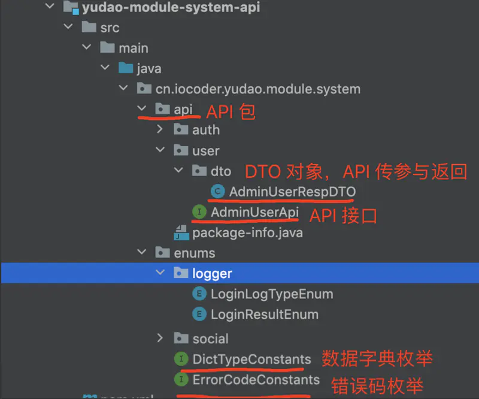
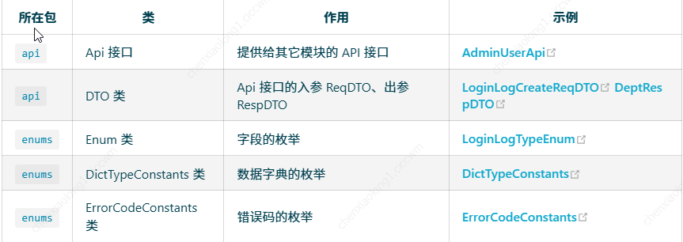
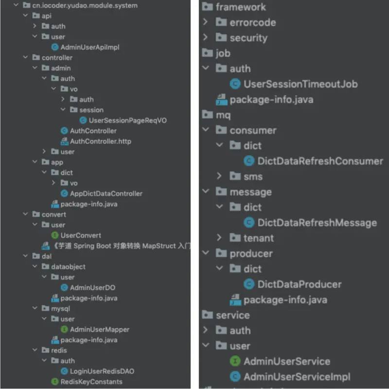
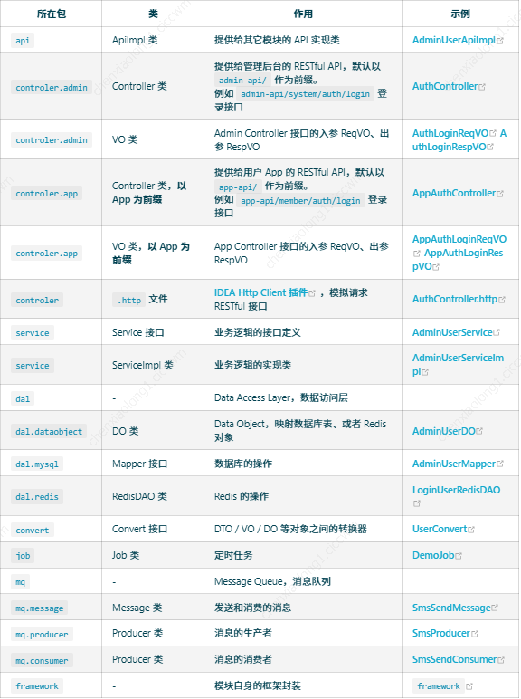
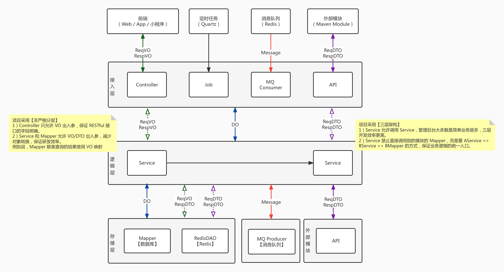

# 开发说明
- dev 是本地开发分支
- master-jdk17 是本地同步分支；始终与源仓库分支一致
- dev 合并源仓库更新，通过，在本地master-jdk17 分支上 rebase

```bash
# 1.fork开源项目到自己的仓库,比如从
github.com/abc/cherry => github.com/dhl/cherry
# 然后clone 
git clone https://github.com/dhl/cherry
# 2.接下来cd到自己的仓库，开始如下操作
cd cherry
git checkout -b dev    #默认是master，master里永远跟开源的保持一致
git pull
git checkout master   #切回master，做更新
git remote add upstream https://github.com/abc/cherry.git  #设置upstream开源仓库.
git fetch upstream master #拉取开源的仓库upstream的master到本地
git merge upstream/master  #合并到本地master
git checkout dev  #切换到dev
git rebase master  #把刚刚拉取的更新merge到dev分支


```

# 运行后端项目

## 开发文档

[开发文档](https://doc.iocoder.cn/feature/)

## 安装Apifox

[下载地址](https://apifox.com/?utm_source=baidu_pinzhuan&utm_medium=sem&utm_campaign=pinzhuan&utm_content=pinzhuan&utm_term=apifox)
[apt清华源](https://mirrors.tuna.tsinghua.edu.cn/help/ubuntu/)

## 安装Mysql

### 麒麟
[参考](https://blog.csdn.net/LogosTR_/article/details/125602116)

```bash
sudo apt update
sudo apt install mysql-server
mysql --version
service mysql status

# 配置
sudo mysql
use mysql;
select user, host, plugin from user;
# 将root对应的plugin由 auth_socket 改为 mysql_native_password 即使是mysql8.0也是，否则影响后续远程连接:
#MySQL8.0必须先执行此步骤设置密码，MySQL5.7可以选择先安装下面的secure！！！
alter user 'root'@'localhost' identified with mysql_native_password by 'root';

flush privileges;

exit;

```
### MAC

### DataGrip

[下载地址](https://www.jetbrains.com/datagrip/download/other.html)

## 安装Redis

[参考](https://redis.com.cn/linux-install-redis.html)

[官网](https://redis.io/docs/latest/operate/oss_and_stack/install/install-redis/install-redis-from-source/)
```bash
wget http://download.redis.io/redis-stable.tar.gz
tar -xzvf redis-stable.tar.gz
cd redis-stable
make

sudo make MALLOC=libc
make BUILD_TLS=yes
make install


# 运行
redis-server &
redis-server /etc/redis.conf
```

## Rebel 插件热加载

### 安装
[2022.4.1 版本](https://plugins.jetbrains.com/plugin/4441-jrebel-and-xrebel/versions)

> 激活地址：https://jrebel.qekang.com/1e67ec1b-122f-4708-87d0-c1995dc0cdaa
> 点击 Work Offine 按钮，设置为离线模式

### 使用
> 点击 Debug With JRebel 按钮； 使用 JRebel启动项目


## 启动问题处理

> 程序包cn.iocoder.yudao.framework.test.core.ut不存在

先编译安装一次

```bash
# 先编译 安装一次
mvn clean install package '-Dmaven.test.skip=true'
```

# 运行前端项目

## 安装node

[参考](https://www.iocoder.cn/NodeJS/mac-install/)

> coke


### nvm

```bash
curl -o- https://raw.githubusercontent.com/creationix/nvm/v0.33.8/install.sh | bash
# or
wget -qO- https://raw.githubusercontent.com/creationix/nvm/v0.33.8/install.sh | bash

# 验证
nvm --version
```

## node

```bash
# 先安装python 3.12

nvm install stable

node -v
npm -v

# 安装 pnpm，提升依赖的安装速度
npm config set registry https://registry.npmmirror.com
npm install -g pnpm
```

## 启动项目

```bash
git clone https://github.com/yudaocode/yudao-ui-admin-vue3.git


# 安装依赖
pnpm install

# 启动服务
npm run dev

```


# 运行小程序

[uni-app官网](https://uniapp.dcloud.net.cn/quickstart.html)

```bash
# 安装依赖
pnpm install

# tab 栏运行
```

# 后端开发
## 结构理解
### yudao-dependencies
> Maven 依赖版本管理

### 业务功能模块：yudao-module-xxx

### 框架封装：yudao-framework

> 技术组件：技术相关的组件封装，例如说 MyBatis、Redis 等等

> 业务组件：业务相关的组件封装，例如说数据字典、操作日志等等。如果是业务组件，名字会包含 biz 关键字

> 每个组件，包含两部分：

- core 包：组件的核心封装，拓展相关的功能。
- config 包：组件的 Spring Boot 自动配置。

## 管理后台/服务端：yudao-server

> 每个模块包含两个 Maven Module，分别是：

- yudao-module-xxx-api	提供给其它模块的 API 定义
- yudao-module-xxx-biz	模块的功能的具体实现


> 例如说，yudao-module-infra 想要访问 yudao-module-system 的用户、部门等数据，需要引入 yudao-module-system-api 子模块

疑问：为什么设计 `yudao-module-xxx-api` 模块呢？

明确需要提供给其它模块的 API 定义，方便未来迁移微服务架构。
模块之间可能会存在相互引用的情况，虽然说从系统设计上要尽量避免，但是有时在快速迭代的情况下，可能会出现。此时，通过只引用对方模块的 API 子模块，解决相互引用导致 Maven 无法打包的问题。


> yudao-module-xxx-api 子模块的项目结构如下




> yudao-module-xxx-biz 子模块的项目结构如下：





```
为什么 Controller 分成 Admin 和 App 两种？

提供给 Admin 和 App 的 RESTful API 接口是不同的，拆分后更加清晰。

疑问：为什么 VO 分成 Admin 和 App 两种？

相同功能的 RESTful API 接口，对于 Admin 和 App 传入的参数、返回的结果都可能是不同的。例如说，Admin 查询某个用户的基本信息时，可以返回全部字段；而 App 查询时，不会返回 mobile 手机等敏感字段。

疑问：为什么 DO 不作为 Controller 的出入参？

明确每个 RESTful API 接口的出入参。例如说，创建部门时，只需要传入 name、parentId 字段，使用 DO 接参就会导致 type、createTime、creator 等字段可以被传入，导致前端同学一脸懵逼。
每个 RESTful API 有自己独立的 VO，可以更好的设置 Swagger 注解、Validator 校验规则，而让 DO 保持整洁，专注映射好数据库表。
疑问：为什么操作 Redis 需要通过 RedisDAO？


Service 直接使用 RedisTemplate 操作 Redis，导致大量 Redis 的操作细节和业务逻辑杂糅在一起，导致代码不够整洁。通过 RedisDAO 类，将每个 Redis Key 像一个数据表一样对待，清晰易维护。
```

> 总结来说，每个模块采用三层架构 + 非严格分层，如下图所示



```
疑问：如果 message 需要跨模块共享，类似 api 的效果，可以怎么做？

可以在 yudao-module-xxx-api 子模块下，新建一个 message 包，可参考 MemberUserCreateMessage 类。

```

>  yudao-server

该模块是后端 Server 的主项目，通过引入需要 yudao-module-xxx 业务模块，从而实现提供 RESTful API 给 yudao-ui-admin-vue3、yudao-mall-uniapp 等前端项目。

本质上来说，它就是个空壳（容器）！如下图所示

# 开发手册

## 新建模块

[新建模块](https://doc.iocoder.cn/module-new/#_1-%E6%96%B0%E5%BB%BA-demo-%E6%A8%A1%E5%9D%97)

